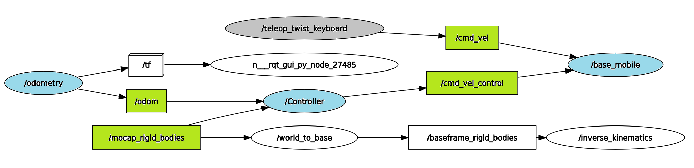

# base_mobile

## Desciption

Here you will find the different ROS2 low/high level nodes and packages for the mobile base.

The low level nodes `base_mobile` and `odometry` use CAN communication, and should be runned directly in the Raspberry pi :

- The `base_mobile` node is the main subscriber node that receives command velocities from a publisher (for e.g. a command published via a teleop_twist_keyboard `cmd_vel` or directly via the high level controller node `cmd_vel_control`).

- `Odometry` is the node that estimate velocity and trajectory from the four base wheels encoders and publish estimated poses and velecoties to the topic `odom`.

The high level control algo contains the `controller` node, which is a Publisher/subscriber node :

- The controller node subscribes to `odom` or `mocap_rigid_bodies` to get the poses of the base. The node contains a `pid_controller` that compare the actual robot trajectory to the reference trajectory, and publish the new command to the `base_mobile` via the topic `cmd_vel_control`.
 
## Base architecture 



Nodes are highlited in blue and Topics in green

# Configuration

In this project, Iam using :

- Raspberry pi : ubuntu server 20.04 lts (ROS2 Foxy)
- Linux Laptop : ubuntu 22.04 lts (ROS2 Humble)
- Optirack tracking system : windows
- Access point : tello_wifi (iP address `192.168.1.1`)

## CAN configuration

Run the following command in the raspberry pi terminal to set the CAN communication :

```sh
sudo /sbin/ip link set can0 down type can bitrate 125000
```

## Network configuration

Before getting started, make sure that a static IP is used for the 3 machines used, for e.g :

- Raspberry pi : `192.168.1.2`
- Linux Laptop : `192.168.1.3`
- Windows Optirack : default address `192.168.1.265`

Once the Ip addresses are set, you can connect the 3 machines to your access point. 
If you can ping the machines from each other then the network configuration is done. 

## ROS configuration

1. Source the setup files
You will need to run this command on every new shell you open to have access to the ROS 2 commands, like so:
```sh
# Replace ".bash" with your shell if you're not using bash
source /opt/ros/foxy/setup.bash
```
if you're using ROS2 Humble 
```sh
# Replace ".bash" with your shell if you're not using bash
source /opt/ros/humble/setup.bash
```
2. Check environment variables

Sourcing ROS 2 setup files will set several environment variables necessary for operating ROS 2. If you ever have problems finding or using your ROS 2 packages, make sure that your environment is properly setup using the following command:
```sh
printenv | grep -i ROS
```
Check that variables like ROS_DISTRO and ROS_VERSION are set. For example, if you’re using Foxy, you would see:
```sh
ROS_VERSION=2
ROS_PYTHON_VERSION=3
ROS_DISTRO=foxy
```

3. The ROS_DOMAIN_ID variable

To set the ROS2 nodes communication over the network we set previously, you can set the environment variable in every new machine with the following command :
```sh
export ROS_DOMAIN_ID=1
```

The ROS 2 development environment needs to be correctly configured before use.
If you ever face any problems locating or using packages with ROS 2, the first thing you should do is check your environment variables and ensure they are set to the version and distro you intended.
For more details, check the ROS2 documentation : https://docs.ros.org/en/foxy/index.html / https://docs.ros.org/en/humble/index.html

## Optitrack configuration

In this project I used ROS2 MoCap Optitrack , click the link for documentation and setup : https://github.com/tud-cor-sr/ros2-mocap_optitrack.git

If you got the error message : `"Rigid body of the base not found"` while running `ros2 launch launch/launch_y_up.py ` , comment line 109 to 114  in file `/mocap_optitrack_w2b/src/WorldToBase.cpp`, save then re`colcon build`.

## Tip

If you don’t want to repeat the configuration every time, you can add the commands to your `~/.bashrc` 

# Usage 

## build 

Before building, make sure the nodes are executables 

```sh
cd ~/base_control_ros2
chmod +x src/base_control/base_control/*
```
Delete the `build  install  log` folders, then build the package.

```sh
cd ~/base_control_ros2
colcon build 
source install/setup.bash
```

## Launch

In the raspberry pi launch the low level subscriber node ``base_mobile``.
```sh
cd ~/base_control_ros2
ros2 run base_control base_mobile
```
(It is better to run the following commands on another linux machine)

You can control the base with a keyboard. To do so, open a new terminal and run : 
```sh
ros2 run teleop_twist_keyboard teleop_twist_keyboard
```
Once you had fun manipulating the base, you can launch the high level control algorithme. 
The controller PID used to control position, need to receive the current position of the base. Here you can either receive the measurement from the odometry estimation or from the optitrack.   

So to begin, run :
```sh
# Open a new terminal 
cd ~/base_control_ros2
ros2 run base_control odometry #to run odometry node 
# Or
cd ~/optitrack
ros2 launch ./src/launch/launch_y_up.py #to run optitrack 
```
Since the odometry use the encoders, you should run it in the raspberry pi terminal. 
Do not launch the 2 nodes at the same time.
Now you can finally launch the `controller` node :
```sh
# Open a new terminal 
cd ~/base_control_ros2
ros2 run base_control controller
```

